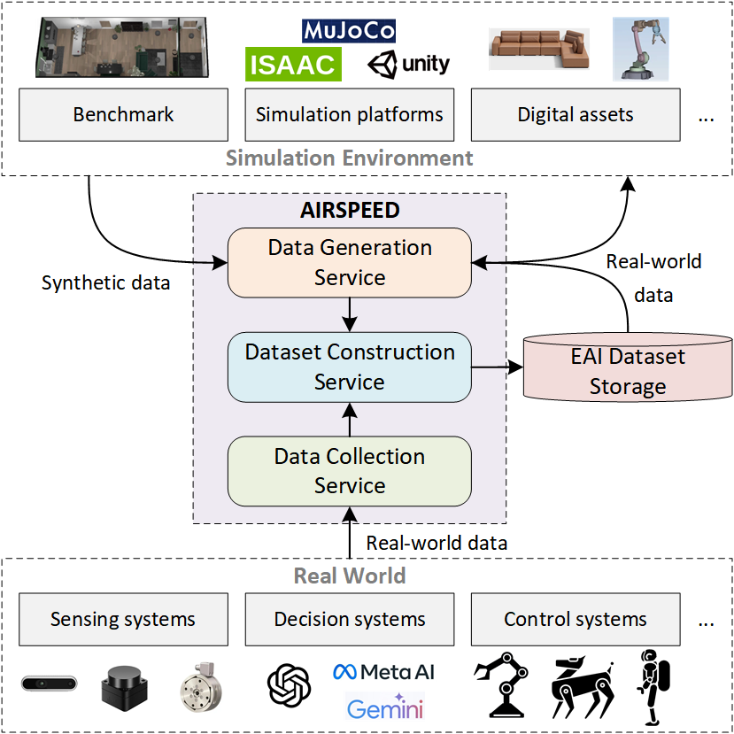
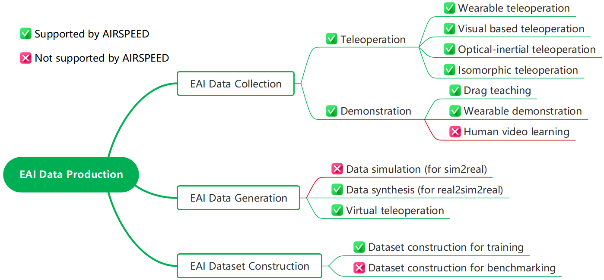

# AIRSPEED: An Open-source Universal Data Production Platform for Embodied Artificial Intelligence
The paper will coming soon.

Welcome to AIRSPEED GitLab page!

## Table of Contents
1. [Introduction](#introduction)
2. [Architecture](#architecture)
3. [Support List](#support-list)
4. [RoadMap](#roadMapt)
5. [Demos](#demos)
   
## Introduction
Data acquisition is widely recognized as one of the key focuses in the development of embodied intelligence today. A critical reason is that Scaling Laws are still considered effective in the field of embodied intelligence, which is reflected in data as the better the performance of the model, the higher the demand for training data. However, data acquisition encounters difficulties in practice, including

* The high cost of collecting a large amount of high-quality human demonstration and robot perception data is difficult to bear. 
* It is difficult to collect data under a rich variety of training scenarios, tasks, and robot model categories. 
* In the process of data collection, there are no corresponding standards or theories to guide whether the collected data has improved the quality of the dataset, whether it has increased the richness of the dataset, and by how much.

To address the above issues, we propose the open-source embodied intelligence data production platform AIRSPEED. AIRSPEED has the following features:

* Hardware-software decoupling - Reduces software costs through an open-source platform, helping to collect high-quality data at a low cost
* Multiple devices supporting - Supports a variety of data acquisition technologies to ensure a rich variety of scenarios/tasks/models, helping to comprehensively obtain highly generalized data
* Multiple simulation platform docking - Assists in quickly producing a large amount of data with synthetic samples
* Dataset automatic construction - Provides a method for constructing embodied intelligence datasets and offers a qualitative assessment method for the performance potential of the dataset

## Architecture
AIRSPEED consists of three major services: Data Collection Service, Data Generation Service, and Dataset Construction Service.

* Data Collection Service is used for collecting data from the real world. It supports various real-world data collection technologies and strives to achieve the best compromise between data latency, data transmission bandwidth, data quality, and computing resources.
* Data Generation Service is used for generating data from simulation environments. It supports various simulation environment data generation technologies and can perform spatial, temporal, and unit alignment on the data.
* Dataset Construction Service is used for automated dataset construction. It can categorize model data, task data, scene data, and execution data into a pyramid structure and provide a qualitative assessment of the dataset's performance potential.

 

## Support List
As shown in the figure, AIRSPEED supports the following data acquisition technologies, data generation technologies, and dataset type constructions:

* EAI Data Collection
    *  Teleoperation
        *  Wearable teleoperation
        *  Visual based teleoperation
        *  Optical-inertial teleoperation
        *  Isomorphic teleoperation
    *  Demonstration
        *  Drag teaching
        *  Wearable demonstration
* EAI Data Generation
    *  Data synthesis
    *  Virtual teleoperation
* EAI Dataset Construction
    *  Dataset construction for training

## RoadMap
* v0.8
    *  Three major service architectures
    *  Optical-inertial teleoperation
* v0.9
    *  Data collection service features
    *  Dataset construction service features
    *  Virtual teleoperation
* v1.0
    *  Unlocking features of the three major services
    *  Homogeneous teleoperation
* v1.1
    *  Refinement of features of the three major services
    *  Support for more hardware
    *  Support for more simulation platforms
   
## Demos
We provide three data collection demos.
1. [Real-World Teleoperation Data Collection](./demo/real_world_optical_inertial_teleoperation.md)
2. [Simulation Environment Teleoperation Data Collection]()
3. [ALOHA Data Collection]()
